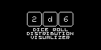

# 2d6

[Play Online](https://tiberiusbrown.github.io/Ardens/player.html?file=https://github.com/rocktronica/2d6/raw/main/2d6.ino.hex)

Roll one six-sided die. Its possible values are 1 to 6, and each is equally likely to be rolled.

Then roll two six-sided dice. Their sums are 2 to 12, but are they also equally likely? Why?

This is an Ardubody game utility to explore exactly that. Roll dice and graph their distributions, and see how the curve changes based on dice per roll and sides per die. It is a crude way to explore a kind of complex idea!

| Buttons   | Action                      |
| --------- | --------------------------- |
| Up/Down   | move dialog cursor / scroll |
| A         | back / reset                |
| B         | select / roll               |
| Right + B | roll++                      |

NOTE: This is my second Arduboy project and I don't write a lot of C++. Memory management is not great.

## License

MIT
